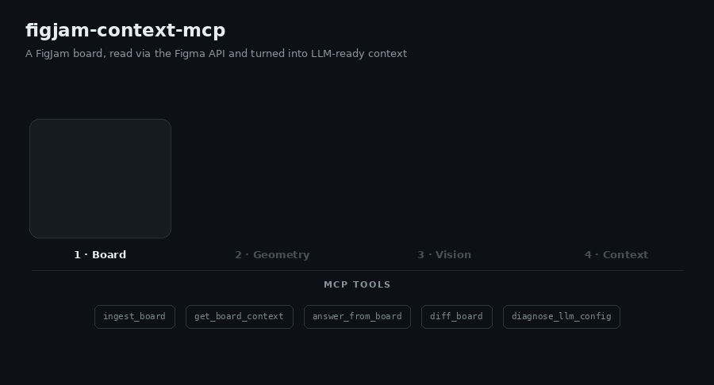

# figjam-context-mcp



*Illustrative overview of the ingest pipeline — not a screen recording.*

MCP server that turns a FigJam board into queryable context for LLMs — read
directly via the Figma REST API, no manual PDF-export detour. It exposes
five tools:

- **ingest_board** — reads a FigJam/Figma file, clusters its content
  spatially, verifies and labels each cluster with a vision model, extracts
  connector arrows as cluster-to-cluster relations, and caches the result
  under a `boardId` (= the Figma file key).
- **get_board_context** — returns a compact, paste-ready context block
  (clusters + connector relations) for an ingested board, optionally scoped
  to a topic.
- **answer_from_board** — answers a free-form question about an ingested
  board, citing the clusters the answer was derived from.
- **diff_board** — compares two ingest snapshots of the same board and
  reports what changed: new/removed/modified clusters, edited nodes, and
  connector changes ("what came in since the last workshop?").
- **diagnose_llm_config** — runs small text + vision JSON checks against the
  active model setup and reports actionable failures.

Ingested boards survive server restarts: `get_board_context` and
`answer_from_board` transparently restore the last finished ingest from
`.cache/figjam-mcp/` when the in-memory store is empty.

Re-ingests are incremental: every cluster's member content is hashed, and
clusters that didn't change simply reuse their previous label/summary — only
new or edited clusters hit the vision model. Re-ingesting a mostly unchanged
board is therefore almost free. Pass `forceFullIngest: true` to bypass all
caching and reuse (e.g. after switching models).

## How it works

FigJam boards are spatially chaotic: rotated stickies, overlapping shapes,
embedded screenshots, no reading order. The pipeline therefore combines
geometry with vision:

1. `fetchFileTree` + `flattenNodeTree` — pull the raw node tree and flatten
   it into normalized nodes (position, size, rotation, text, image refs,
   connector endpoints), dropping empty structural noise.
2. `geometricPreCluster` — rotation-aware distance clustering into coarse
   groups. Neighbor search runs over a spatial grid (near-linear instead of
   O(n²)), and the gap threshold adapts to the board's density (median
   nearest-neighbor gap) so dense and airy boards both cluster sensibly.
   Huge footprints use a bounded overflow path, and connected components over
   250 nodes are spatially bisected before reaching an LLM.
3. `extractConnectorEdges` + `buildClusterRelations` — connector arrows are
   excluded from geometric clustering (they deliberately span groups) but
   captured as a graph: "cluster A → cluster B (label)". These relations are
   included in `get_board_context` output and the `answer_from_board`
   prompt — arrows are the board's semantic structure.
4. `refineClusterWithVision` — per cluster, node screenshots + extracted
   text go to a vision model in one request; it confirms which nodes belong
   together, labels the group, describes embedded images, and writes a 3–5
   sentence summary. Clusters are refined concurrently
   (`INGEST_BOARD_VISION_CONCURRENCY`, default 3) within the vision budget.
5. `mapClustersToPhases` (optional) — assigns each cluster to a phase of the
   chosen framework: `double_diamond`, `lean_canvas`, `retro`,
   `user_journey`, or a free-form `customPhases` list (or "unclear").
6. Results are cached in-memory AND persisted per file key;
   `get_board_context` and `answer_from_board` read from the cache and
   restore from disk after a restart.

## Setup

```bash
npm install
cp .env.example .env
```

Fill in `.env`:

**`FIGMA_ACCESS_TOKEN`** — log in at [figma.com](https://www.figma.com), go
to **Settings → Security → Personal access tokens**, generate a token. (Can
also be passed per-call via the `figmaAccessToken` input on `ingest_board`.)

**`LLM_BASE_URL` / `LLM_API_KEY` / `LLM_MODEL_PRESET`** — any
OpenAI-compatible endpoint. Free options:

- **OpenRouter** (default in `.env.example`): get a key at
  [openrouter.ai/keys](https://openrouter.ai/keys). The default
  `student-free` preset uses explicit free models for each role:
  `google/gemma-4-26b-a4b-it:free` for vision and
  `qwen/qwen3-next-80b-a3b-instruct:free` plus
  `nvidia/nemotron-nano-9b-v2:free` for text/Q&A. `openrouter/free` remains
  a last-resort fallback, not the primary model.
- **GitHub Models**: free with any GitHub account — create a token at
  [github.com/marketplace/models](https://github.com/marketplace/models),
  set `LLM_BASE_URL=https://models.github.ai/inference`.

Optional overrides:

- `LLM_MODEL_PRESET` — currently supported: `student-free`.
- `LLM_VISION_MODELS` — comma-separated vision model candidates.
- `LLM_TEXT_MODELS` — comma-separated text/Q&A candidates.
- `LLM_FAST_TEXT_MODELS` — comma-separated small/fast text candidates.
- Legacy `LLM_VISION_MODEL` / `LLM_TEXT_MODEL` still work as first-candidate
  overrides.

## Run

```bash
npm run dev
```

This starts the MCP server over stdio using `tsx watch`. To try the tools
interactively:

```bash
npx @modelcontextprotocol/inspector npx tsx src/index.ts
```

> **Note:** don't pass plain `npm run dev` to the Inspector (or any MCP
> client) — npm prints a lifecycle banner to stdout
> before the server starts, which corrupts the JSON-RPC stream the client
> expects there. Either invoke `tsx` directly as above, or add `--silent`:
> `npx @modelcontextprotocol/inspector npm run dev --silent`.

### MCP UI timeouts

`ingest_board` can be slow because it calls Figma and a vision LLM for board
clusters. If the MCP UI shows `MCP error -32001: Request timed out`, the client
gave up before those external calls finished.

The server now keeps provider calls bounded by default:

- `FIGMA_REQUEST_TIMEOUT_MS=15000`
- `FIGMA_FILE_REQUEST_TIMEOUT_MS=60000`
- `LLM_REQUEST_TIMEOUT_MS=20000`
- `LLM_RATE_LIMIT_RETRIES=1`
- `LLM_ANSWER_MAX_OUTPUT_TOKENS=800`
- `LLM_VISION_MAX_OUTPUT_TOKENS=4096`
- `LLM_ANSWER_TOP_K=6`
- `LLM_ANSWER_PROMPT_MAX_CHARS=24000`
- `INGEST_BOARD_VISION_BUDGET_MS=35000`
- `INGEST_BOARD_VISION_CONCURRENCY=3`
- `FIGMA_SCREENSHOT_DOWNLOAD_CONCURRENCY=3`
- `FIGJAM_MCP_MEMORY_CACHE_MAX_BOARDS=10`

`ingest_board` defaults to `ingestMode: "balanced"`: text-rich clusters use
deterministic summaries, while image-heavy or low-text clusters use vision
within the budget. `max_speed` skips vision; `max_quality` attempts vision for
every cluster. Finished ingests are persisted under `.cache/figjam-mcp/`, keyed
by file state, node hash, model preset, document hint, and ingest mode.

Vision candidates are prioritized by information gain rather than canvas
position. Each request has bounded node/text inventory, and the phase returns
at its configured deadline even if a provider stalls. `answer_from_board`
retrieves the most relevant clusters plus direct connector neighbours and keeps
the complete prompt under its configured character budget. The in-memory cache
uses LRU eviction; persisted history keeps 20 states and removes snapshots that
become safely unreferenced.

Run `diagnose_llm_config` after changing model env vars. It verifies structured
text replies with small arithmetic challenges and checks actual image
understanding with a known color image, without ingesting a board.

## Usage example

Paste in a Figma board link and ingest it:

```jsonc
// tool: ingest_board
{
  "figmaFileUrl": "https://www.figma.com/board/AbC123XyZ456/Semester-Project-Research",
  "docStructureHint": "double_diamond"
}
// → { "boardId": "AbC123XyZ456", "clusterCount": 5, "relationCount": 3,
//     "summary": "Ingested board AbC123XyZ456: 5 clusters — \"User interview quotes\", \"Problem framing\", …" }
```

Instead of a built-in framework (`double_diamond`, `lean_canvas`, `retro`,
`user_journey`) you can pass your own phase names — clusters are then mapped
onto them by keyword match:

```jsonc
{ "figmaFileUrl": "…", "customPhases": ["Ideen", "Feedback", "Offene Fragen"] }
```

The `boardId` is the file key itself — re-running `ingest_board` on the same
file refreshes the cache entry. Then pull context, optionally scoped to a
topic:

```jsonc
// tool: get_board_context
{ "boardId": "AbC123XyZ456", "topic": "user research" }
// → contextText:
// FigJam board AbC123XyZ456 — 2 of 5 clusters (topic: user research):
//
// ## User interview quotes [discover]
// Sticky notes with verbatim quotes from six student interviews about exam
// stress. Two embedded screenshots show survey results (bar charts of study
// habits). Main pain points: unclear requirements and late feedback. …
//
// ## Connections between clusters (from connector arrows)
// - "User interview quotes" → "Problem framing" — "informs"
```

The `contextText` block is deliberately token-lean — paste it straight into
a documentation-writing chat (e.g. for a semester report). Or ask directly:

```jsonc
// tool: answer_from_board
{ "boardId": "AbC123XyZ456", "question": "What were the main user pain points?" }
// → { "answer": "Unclear requirements and late feedback …",
//     "citedClusters": ["User interview quotes", "Problem framing"] }
```

After the board evolved (say, workshop 2), ingest again — unchanged clusters
are reused, so this is fast — and diff the snapshots:

```jsonc
// tool: diff_board
{ "boardId": "AbC123XyZ456" }
// → summaryText:
// FigJam board AbC123XyZ456 — changes from 2026-07-03T14:02:11Z to 2026-07-10T09:41:52Z:
//
// New clusters (1):
// - "Feedback round 2": Sticky notes with feedback from the second usability test.
// Modified clusters (1):
// - "User interview quotes": +3 nodes, 1 edited
// Connections: +1 / -0
// - new: "Feedback round 2" → "Problem framing" — "confirms"
// Nodes: +9 added / -0 removed / 1 edited.
// Unchanged clusters: 4.
```

`compareTo` selects an older baseline (2 = two ingests back, …); the history
keeps the last 20 distinct board states per file.

## Scripts

- `npm run dev` — run the server with `tsx watch` (auto-restart on change).
- `npm run build` — clean and compile TypeScript to `dist/`, preserving an executable CLI.
- `npm start` — run the compiled server from `dist/`.
- `npm test` — run the Vitest test suite.
- `npm run typecheck` — type-check both source and tests without emitting files.
- `npm run check` — type-check, test, build, and validate the package metadata/binary.
- `npm run package:smoke` — pack the npm tarball, execute its CLI, and verify MCP initialization/tool discovery.

Publishing runs the same checks automatically through `prepack`; CI exercises
that complete package path on the minimum supported Node version and an LTS line.

## Project layout

```
src/
├── index.ts        # stdio entrypoint
├── server.ts       # McpServer setup + tool registration
├── tools/          # tool handlers (ingest pipeline, context, Q&A)
├── schemas/        # Zod input/output schemas per tool
├── lib/            # Figma API, node tree, clustering, vision, LLM, cache
└── types.ts        # shared domain types
```
