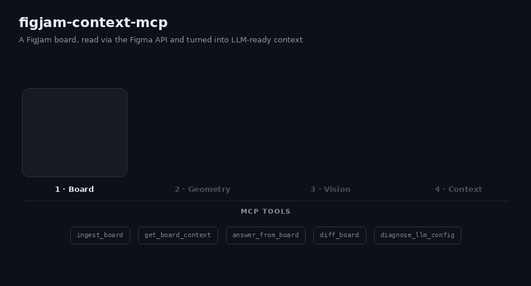

# figjam-context-mcp



*Illustrative overview of the ingest pipeline — not a screen recording.*

MCP server that turns a FigJam board into queryable context for LLMs — read
directly via the Figma REST API, no manual PDF-export detour. It exposes
five tools over a local stdio connection (Node.js 22.12+):

- **ingest_board** — reads a FigJam/Figma file, clusters its content
  spatially, verifies and labels each cluster with a vision model, extracts
  connector arrows as cluster-to-cluster relations, and caches the result
  under a `boardId` (= the Figma file key).
- **get_board_context** — returns a compact, paste-ready context block
  (clusters + connector relations) for an ingested board, optionally scoped
  to a topic.
- **answer_from_board** — answers a free-form question about an ingested
  board, citing the clusters the answer was derived from.
- **diff_board** — compares two ingest snapshots of the same board and
  reports what changed: new/removed/modified clusters, edited nodes, and
  connector changes ("what came in since the last workshop?").
- **diagnose_llm_config** — runs small text + vision JSON checks against the
  active model setup and reports actionable failures.

Ingested boards survive server restarts: `get_board_context` and
`answer_from_board` transparently restore the last finished ingest from
the private per-user cache when the in-memory store is empty. See
[cache and migration](#cache-and-migration) for locations and upgrade behavior.

Re-ingests are incremental: every cluster's member content is hashed, and
successful interpretations are reused when their content and configuration
still match. New or edited clusters and eligible unfinished vision work are
processed within the remaining budget. Model, provider and prompt changes
automatically invalidate derived results; they do not require a forced ingest.
Figma is still checked for changes. Use `forceFullIngest: true` only for a
deliberate complete rebuild: it skips successful cached interpretations too.

## How it works

FigJam boards are spatially chaotic: rotated stickies, overlapping shapes,
embedded screenshots, no reading order. The pipeline therefore combines
geometry with vision:

1. `fetchFileTree` + `flattenNodeTree` — pull the raw node tree and flatten
   it into normalized nodes (position, size, rotation, text, image refs,
   connector endpoints), dropping empty structural noise.
2. `geometricPreCluster` — rotation-aware distance clustering into coarse
   groups. Neighbor search runs over a spatial grid (near-linear instead of
   O(n²)), and the gap threshold adapts to the board's density (median
   nearest-neighbor gap) so dense and airy boards both cluster sensibly.
   Huge footprints use a bounded overflow path, and connected components over
   250 nodes are spatially bisected before reaching an LLM.
3. `extractConnectorEdges` + `buildClusterRelations` — connector arrows are
   excluded from geometric clustering (they deliberately span groups) but
   captured as a graph: "cluster A → cluster B (label)". These relations are
   included in `get_board_context` output and the `answer_from_board`
   prompt — arrows are the board's semantic structure.
4. `refineClusterWithVision` — per cluster, node screenshots + extracted
   text go to a vision model in one request; it confirms which nodes belong
   together, labels the group, describes embedded images, and writes a 3–5
   sentence summary. Clusters are refined concurrently
   (`INGEST_BOARD_VISION_CONCURRENCY`, default 3) within the vision budget.
5. `mapClustersToPhases` (optional) — assigns each cluster to a phase of the
   chosen framework: `double_diamond`, `lean_canvas`, `retro`,
   `user_journey`, or a free-form `customPhases` list (or "unclear").
6. Results are cached in-memory AND persisted per file key;
   `get_board_context` and `answer_from_board` read from the cache and
   restore from disk after a restart.

## Setup

Requires **Node.js 22.12+**; CI is configured for Node 22 and 24 LTS.

### Install a release candidate for normal use

Install the approved local tarball into a dedicated runtime directory. This does
not require TypeScript, a source checkout or development dependencies:

```bash
mkdir figjam-runtime
cd figjam-runtime
npm init -y
npm install --omit=dev /absolute/path/to/figjam-context-mcp-0.4.0.tgz
cp node_modules/figjam-context-mcp/.env.example .env
node node_modules/figjam-context-mcp/dist/index.js --version
```

Configure the keys below, then point your MCP client at the absolute installed
entry point: `/absolute/path/to/figjam-runtime/node_modules/figjam-context-mcp/dist/index.js`.
Set its working directory to `figjam-runtime` when using that `.env`, or supply
the keys in the MCP client's environment. The candidate is local and unpublished;
installing `figjam-context-mcp@0.4.0` from npm is only possible after publication.

### Build from source

For development and the Inspector configuration in this repository:

```bash
git clone https://github.com/ecestnrkl/figjam-mcp.git
cd figjam-mcp
npm ci
cp .env.example .env
npm run build
```

On Windows PowerShell use `Copy-Item .env.example .env`. Run commands from the
repository directory when relying on `.env`, or pass environment variables from
your MCP client's settings. This checkout prepares version 0.4.0; a checked-in
version or registry metadata file does not mean it has been published to npm.

Fill in `.env`:

**`FIGMA_ACCESS_TOKEN`** — log in at [figma.com](https://www.figma.com), go
to **Settings → Security → Personal access tokens**, generate a token with
**`file_content:read`** and access to the board. Scopes do not override file
permissions ([Figma scope documentation](https://developers.figma.com/docs/rest-api/scopes/)).
Keep it in the environment. The optional `figmaAccessToken` tool input remains
compatible, but client tool-call logs can expose argument values.

**`LLM_BASE_URL` / `LLM_API_KEY` / `LLM_MODEL_PRESET`** — any
OpenAI-compatible endpoint. The bundled preset targets OpenRouter. Provider options:

- **OpenRouter** (default in `.env.example`): get a key at
  [openrouter.ai/keys](https://openrouter.ai/keys). The default
  `student-free` preset uses explicit free models for each role:
  `google/gemma-4-26b-a4b-it:free` for vision and
  `qwen/qwen3-next-80b-a3b-instruct:free` plus
  `nvidia/nemotron-nano-9b-v2:free` for text/Q&A. `openrouter/free` remains
  a last-resort fallback, not the primary model.
- **GitHub Models**: free with any GitHub account — create a token at
  [github.com/marketplace/models](https://github.com/marketplace/models),
  set `LLM_BASE_URL=https://models.github.ai/inference`.

Optional overrides:

- `LLM_MODEL_PRESET` — currently supported: `student-free`.
- `LLM_VISION_MODELS` — comma-separated vision model candidates.
- `LLM_TEXT_MODELS` — comma-separated text/Q&A candidates.
- `LLM_FAST_TEXT_MODELS` — comma-separated small/fast text candidates.
- Legacy `LLM_VISION_MODEL` / `LLM_TEXT_MODEL` still work as first-candidate
  overrides.

Model availability, free quotas and pricing can change. Override the role model
lists for your provider and run `diagnose_llm_config` to verify JSON and vision
support. The `student-free` preset is a convenience configuration, not a service
availability or zero-cost guarantee. `max_speed` ingestion and `get_board_context`
work without an LLM key; answers, diagnostics and vision require one.

If the diagnostic reports **`LLM_API_KEY is not set`**, set the model provider's
key in the MCP client's server environment and restart that connection. A Figma
access token does not replace the model provider key. A project `.env` is only
loaded automatically when the server starts from that directory. Missing model
configuration is detected before vision screenshots are downloaded; original
texts and table cells remain available for local search.

## Run

Use the compiled entry point for a normal MCP connection:

```bash
node /absolute/path/to/figjam-mcp/dist/index.js
```

For clients accepting a standard `mcpServers` configuration, substitute your
absolute path and configure secrets in the client's protected environment settings:

```json
{
  "mcpServers": {
    "figjam-context": {
      "command": "node",
      "args": ["/absolute/path/to/figjam-mcp/dist/index.js"],
      "env": {
        "FIGMA_ACCESS_TOKEN": "YOUR_FIGMA_TOKEN",
        "LLM_BASE_URL": "https://openrouter.ai/api/v1",
        "LLM_API_KEY": "YOUR_PROVIDER_KEY"
      }
    }
  }
}
```

On Windows, use an absolute path with forward slashes. If a GUI cannot find Node,
set `command` to its absolute executable path. This server is local stdio only;
it does not provide a public HTTP URL or hosted authentication service.

For development with automatic restart:

```bash
npm run dev
```

This starts the MCP server over stdio using `tsx watch`. To try the tools
interactively, run from this repository's root after installing dependencies:

```bash
npx @modelcontextprotocol/inspector --config inspector.config.json
```

The Inspector v2 config starts the local source with a three-minute request
timeout and loads `.env` from the project directory. It contains no credentials.
Restart this Inspector connection after source or environment changes.

> **Note:** don't pass plain `npm run dev` to the Inspector (or any MCP
> client) — npm prints a lifecycle banner to stdout
> before the server starts, which corrupts the JSON-RPC stream the client
> expects there. Either invoke `tsx` directly as above, or add `--silent`:
> `npx @modelcontextprotocol/inspector npm run dev --silent`.

### MCP UI timeouts

`ingest_board` can be slow because it calls Figma and a vision LLM for board
clusters. If the MCP UI shows `MCP error -32001: Request timed out`, a client or
relay deadline expired before it received the final result. The server may still
be working, or the result may already be saved while delivery is delayed.

`INGEST_BOARD_VISION_BUDGET_MS` limits only the vision phase, not the complete
ingest. Metadata checks, the full file download when needed, grouping and saving
add to its duration; a 60-second client timeout can therefore expire before a
valid ingest finishes. The supplied `inspector.config.json` sets
`requestTimeout: 180000` (milliseconds) for local testing. Inspector v2 defines
this [per-server request timeout](https://github.com/modelcontextprotocol/inspector/blob/main/docs/mcp-server-configuration.md);
it does not increase the server's vision budget or enable additional models.
If a request has timed out and remains unanswered, disconnect the old connection
before retrying so another ingest does not wait behind unfinished work.

Inspector 2.10.1's web relay also has independent 60-second response watchdogs
that are not controlled by this setting. During a local Safari test, an ingest
saved its result and reported `complete`, but its final response appeared only
after a later context request. Increasing `requestTimeout` alone does not resolve
that observed delivery issue. If the web UI stalls after completion, the Inspector
CLI uses the direct stdio path and avoids that browser relay:

```bash
npx @modelcontextprotocol/inspector --cli --config inspector.config.json \
  --server figjam-local --method tools/call --tool-name ingest_board \
  --tool-arg figmaFileUrl=https://www.figma.com/board/YOUR_FILE_KEY \
  ingestMode=max_quality forceFullIngest=false --format json
```

Replace `YOUR_FILE_KEY` with your file key. Keep `forceFullIngest=false` to retain
successful interpretations while retrying unfinished work. A forced full ingest
deliberately skips reuse and does not remove the vision phase's time budget.
See the [local delivery investigation](https://github.com/ecestnrkl/figjam-mcp/blob/main/docs/reviews/2026-10-09-inspector-timeout.md)
for the observed behavior and limits of the diagnosis.

Restarting the server does not require re-ingestion of a successfully persisted
v4 snapshot. Call `get_board_context` or `answer_from_board` with the same
`boardId`; they load the snapshot from disk. A fresh Inspector session may no
longer display earlier tool results, but that is separate from the server cache.
Keep the same user and `FIGJAM_MCP_CACHE_DIR`. Re-ingest to refresh board content,
retry incomplete vision, migrate v3, or recover an ingest that was not persisted.

The server now keeps provider calls bounded by default:

- `FIGMA_REQUEST_TIMEOUT_MS=15000`
- `FIGMA_FILE_REQUEST_TIMEOUT_MS=60000`
- `LLM_REQUEST_TIMEOUT_MS=20000`
- `LLM_RATE_LIMIT_RETRIES=1`
- `LLM_ANSWER_MAX_OUTPUT_TOKENS=2048` (includes any provider reasoning tokens)
- `LLM_VISION_MAX_OUTPUT_TOKENS=4096`
- `LLM_ANSWER_TOP_K=6`
- `LLM_ANSWER_PROMPT_MAX_CHARS=24000`
- `INGEST_BOARD_VISION_BUDGET_MS=35000`
- `INGEST_BOARD_VISION_CONCURRENCY=3`
- `FIGMA_SCREENSHOT_DOWNLOAD_CONCURRENCY=3`
- `FIGJAM_MCP_MEMORY_CACHE_MAX_BOARDS=10`

`ingest_board` defaults to `ingestMode: "balanced"`: text-rich clusters use
deterministic summaries, while image-heavy or low-text clusters use vision
within the budget. `max_speed` skips vision; `max_quality` attempts vision for
every cluster. Finished ingests persist immutable source snapshots separately
from provider-dependent interpretation, with identities covering file content,
model/provider configuration, extraction/prompt version, phase hint and ingest mode.

Vision candidates are prioritized by information gain rather than canvas
position. Each request has bounded node/text inventory, and the phase returns
at its configured deadline even if a provider stalls. `answer_from_board`
retrieves the most relevant clusters plus direct connector neighbours and keeps
the complete prompt under its configured character budget. The in-memory cache
uses LRU eviction; persisted history keeps 20 states and removes snapshots that
become safely unreferenced. Client cancellation reaches provider calls and ingest
work; clients requesting progress receive phase updates. Network work is bounded
by a 64 MiB file response, 100,000 traversed nodes, 8 MiB per image and 64 MiB
of screenshot downloads per ingest. Oversized files fail with an actionable error.

Run `diagnose_llm_config` after changing model env vars. It verifies structured
text replies with small arithmetic challenges and checks actual image
understanding with a known color image, without ingesting a board.

## Usage example

Paste in a Figma board link and ingest it:

```jsonc
// tool: ingest_board
{
  "figmaFileUrl": "https://www.figma.com/board/AbC123XyZ456/Semester-Project-Research",
  "docStructureHint": "double_diamond"
}
// → { "boardId": "AbC123XyZ456", "clusterCount": 5, "relationCount": 3,
//     "summary": "Ingested board AbC123XyZ456: 5 clusters — \"User interview quotes\", \"Problem framing\", …" }
```

Instead of a built-in framework (`double_diamond`, `lean_canvas`, `retro`,
`user_journey`) you can pass your own phase names — clusters are then mapped
onto them by keyword match:

```jsonc
{ "figmaFileUrl": "…", "customPhases": ["Ideen", "Feedback", "Offene Fragen"] }
```

The `boardId` is the file key itself — re-running `ingest_board` on the same
file refreshes the cache entry. Then pull context, optionally scoped to a
topic:

```jsonc
// tool: get_board_context
{ "boardId": "AbC123XyZ456", "topic": "user research" }
// → contextText:
// FigJam board AbC123XyZ456 — 2 of 5 clusters (topic: user research):
//
// ## User interview quotes [discover]
// Sticky notes with verbatim quotes from six student interviews about exam
// stress. Two embedded screenshots show survey results (bar charts of study
// habits). Main pain points: unclear requirements and late feedback. …
//
// ## Connections between clusters (from connector arrows)
// - "User interview quotes" → "Problem framing" — "informs"
```

The `contextText` block is deliberately token-lean — paste it straight into
a documentation-writing chat (e.g. for a semester report). Or ask directly:

```jsonc
// tool: answer_from_board
{ "boardId": "AbC123XyZ456", "question": "What were the main user pain points?" }
// → { "answer": "Unclear requirements and late feedback …",
//     "citedClusters": ["User interview quotes", "Problem framing"] }
```

After the board evolved (say, workshop 2), ingest again — unchanged clusters
are reused, so this is fast — and diff the snapshots:

```jsonc
// tool: diff_board
{ "boardId": "AbC123XyZ456" }
// → summaryText:
// FigJam board AbC123XyZ456 — changes from 2026-07-03T14:02:11Z to 2026-07-10T09:41:52Z:
//
// New clusters (1):
// - "Feedback round 2": Sticky notes with feedback from the second usability test.
// Modified clusters (1):
// - "User interview quotes": +3 nodes, 1 edited
// Connections: +1 / -0
// - new: "Feedback round 2" → "Problem framing" — "confirms"
// Nodes: +9 added / -0 removed / 1 edited.
// Unchanged clusters: 4.
```

`compareTo` selects an older baseline (2 = two ingests back, …); the history
keeps the last 20 distinct board states per file.

### Bounded context and source citations

`get_board_context` adds `snapshotId`, `evidence`, `connections`, `totalMatched`,
`truncated`, explicit `truncation` counts and optional `nextCursor`. The existing `contextText`, `clusters` and
`relations` remain available. Use `limit` (default 20, maximum 100) and `maxChars`
(default 12,000, maximum 24,000) to control a page. To continue, send `nextCursor`
back as `cursor` with the same query and budgets. Cursors bind the snapshot so a
later ingest cannot silently change the next page. Exact `nodeIds` lookups can
retrieve original text/table cells (up to 50 IDs); `topic` and `nodeIds` are mutually exclusive.
The complete readable and structured result is limited to 128 KiB. A page never
silently skips a partially returned source chunk; increase `maxChars` if one
chunk cannot fit. Cursors also reject changed interpretation results.

Without search parameters the tool returns a bounded overview across clusters.
Topic search uses Unicode-aware local BM25 over original text, table cells and
descriptive names, supplemented by direct graph neighbors and up to six related
table-cell excerpts. Cells in the matching row take priority when row positions
are available; missing positions are never inferred. Names and available table
positions remain visible in the source metadata. A topic with no matches now
returns **empty results**, instead of falling back to the entire board.

Structured cluster summaries carry `summarySource` and `modelDerived` alongside
the original evidence. They are derived context, not verbatim quotations;
unknown or cache-only origins are conservatively marked as potentially model
derived. `sourceNodeIds` identifies the source nodes displayed on that page and
does not validate every claim in the cluster summary.

```jsonc
// tool: get_board_context
{ "boardId": "AbC123XyZ456", "topic": "research", "limit": 10, "maxChars": 6000 }
// Next page: same arguments, plus "cursor": "<nextCursor from previous result>".
```

`answer_from_board` retains `answer` and `citedClusters` and adds `snapshotId`
and `citations` containing source node IDs, exact evidence quotes and Figma links.
Original board text/table cells are distinguished from model interpretations.
Answers are instructed to distinguish explicit status statements from open tasks
and proposals. For example, “clarify room availability” does not establish either
“booked” or “not booked”; the booking status remains unconfirmed by that excerpt.
An uncertainty explanation may cite the open task without claiming its outcome.
A quote matching a source does not guarantee the model's inference is correct;
use the source links to verify important conclusions. The tool reports insufficient
evidence when it cannot return a supported answer.

## Cache and migration

Version 0.4.0 uses cache format **v4**, stored beneath a private per-user root:

| Platform | Default root |
| --- | --- |
| macOS | `~/Library/Caches/figjam-context-mcp` |
| Windows | `%LOCALAPPDATA%/figjam-context-mcp` |
| Linux | `$XDG_CACHE_HOME/figjam-context-mcp`, or `~/.cache/figjam-context-mcp` |

Set `FIGJAM_MCP_CACHE_DIR` to use another dedicated private directory. Current
files live in its `v4/` subdirectory. The cache contains board text, node metadata,
interpretations and retained snapshots. Unix files/directories use owner-only
permissions; Windows relies on the user's profile/directory access controls.
The server/client must be trusted to access this user's cache.

Legacy v3 files in `.cache/figjam-mcp/` are preserved. They cannot supply the
complete provenance required by v4: **run `ingest_board` again after upgrading**.
No silent destructive conversion runs. To remove retained data, stop the server
and delete its dedicated cache root; cached context and history then disappear.
When using a custom location, remove only the directory you configured for this
server. Clearing the cache does not remove provider-side request logs.

If a writer crashes and leaves `v4/.write-lock`, future writes fail closed rather
than stealing the lock. Stop **all** instances of this server using that cache,
then remove only `v4/.write-lock` and restart. Never remove the lock while a
writer may still be running. Existing committed snapshots remain readable.

Source snapshot IDs depend on captured board content, not the model. Refinements
use separate immutable revisions, committed together with history through an
atomic manifest replacement. A model change does not create a board-content diff.
Failed vision work remains marked incomplete and is retried on a later ingest;
successful refinements are reused. Provider `Retry-After` delays are respected.

Ingest results include the actual `ingestMode` and `qualityReport.fallbackReasons`.
These distinguish unstarted work deferred by the time budget from rendering,
model, configuration, authorization, rate-limit, response-format, timeout and
download-budget failures. Older generic cache reasons remain explicitly unknown.
`qualityReport.nextRetryAt` records the earliest pending cooldown when present.
Fix missing credentials or authorization before retrying; increasing the time
budget cannot repair these failures. Work deferred by the time budget is given
priority over repeatedly failing clusters on the next ingest. Switching to
`max_speed` intentionally uses text without inheriting a failed vision status.

Repeated ingestion first checks Figma's metadata version when possible. Tokens
without metadata access fall back to a complete file read; other metadata errors
do not claim that the cached board is current. `forceFullIngest` bypasses both
metadata reuse and refinement reuse. Downloads are bounded to 64 MiB per file
tree, 8 MiB per image and 64 MiB of image downloads per ingest. Extraction allows
100,000 nodes and 1,024 nesting levels; dense geometry and metadata have additional
work limits with actionable errors. Cancellation stops later phases and network
work before publication; completed source publication is the operation's commit point.

## Data handling

The server reads Figma and never changes the board. Balanced/quality ingestion
can send board text and screenshots to the configured LLM provider; Q&A sends
selected evidence and your question. Synthetic diagnostic requests also use the
provider. Costs, model availability and retention are controlled by that provider.
For local deterministic retrieval, use `ingestMode: "max_speed"` followed by
`get_board_context`. Review sensitive content before enabling external model calls.
Tokens belong in environment settings, never in issue reports or committed files.

## License and maintenance

[MIT](LICENSE), copyright 2026 ecestnrkl. See [CONTRIBUTING.md](https://github.com/ecestnrkl/figjam-mcp/blob/main/CONTRIBUTING.md),
[SECURITY.md](SECURITY.md) and [CHANGELOG.md](CHANGELOG.md). Dependency updates are
proposed weekly for review. CI is configured to verify the package on Node 22/24 across Linux,
macOS and Windows. The manual Release candidate workflow produces an artifact;
a maintainer approves publication separately.

`glama.json` identifies the maintainer, and `server.json` prepares MCP Registry
metadata for all five capabilities. Neither file publishes the project. After a
real release, refresh the Glama inspection so its tool schema matches the current
version. Maintenance ratings depend on actual maintenance activity over time.

## Scripts

- `npm run dev` — run the server with `tsx watch` (auto-restart on change).
- `npm run build` — clean and compile TypeScript to `dist/`, preserving an executable CLI.
- `npm start` — run the compiled server from `dist/`.
- `npm test` — run the Vitest test suite.
- `npm run typecheck` — type-check both source and tests without emitting files.
- `npm run check` — type-check, test, build, and validate the package metadata/binary.
- `npm run package:smoke` — install the tarball with production dependencies only and exercise its CLI, five MCP tools, context/diff results and errors.
- `npm run package:smoke -- --long` — additionally wait through a synthetic 65-second ingest in the installed server and verify that its final response and saved sources arrive after completion progress. No real Figma or model requests are made by these fixtures.
- `npm run package:smoke -- --artifact-dir /absolute/path/to/new-candidate` — retain the exact tested tarball after every package check succeeds and print its SHA-256 checksum. The destination must not exist; existing candidates are never overwritten. Combine with `--long` for the extended stdio check.
- `npm run security:check` — audit runtime and development dependencies.
- `npm run eval:retrieval` — evaluate the 20 synthetic source/change fixtures locally; no provider calls.
- `npm run eval:retrieval -- --with-llm` — explicitly opt into model evaluation using the configured provider, with measured requests, reported token usage and source checks. Includes separate status-question cases for human review. May incur charges.
- `npm run eval:retrieval -- --with-llm --grounding-only` — call the provider only for the five status-question cases, each with a 45-second deadline; keep the retrieval/change checks offline. Provide `LLM_BASE_URL` and `LLM_API_KEY` in the environment; source users can preload their project `.env` with `node --import dotenv/config --import tsx scripts/evaluate-retrieval.mjs --with-llm --grounding-only`.

Publishing runs the same checks automatically through `prepack`; CI is configured to exercise
that complete package path on Node 22 and 24 across Linux, macOS and Windows.
An additional Linux job verifies the exact minimum Node version, 22.12.0. The
release-candidate workflow retains the tested archive instead of packing a second
one; its long stdio check and dependency audit must pass before artifact upload.
The synthetic evaluator reports lexical retrieval and source traceability, not
general reasoning quality or real-world workshop accuracy. Its historical
summary-visibility comparison is a proxy, not a measured run of the old release.
Missing provider usage and monetary cost are reported as unmeasured.
The status-question cases distinguish unknown, confirmed, explicitly negative,
proposed and conflicting statuses. Their generated answers require human review;
the evaluator does not award a semantic pass based on a citation ID or a mocked
provider response. Offline runs do not measure model compliance with these rules.

## Project layout

```
src/
├── index.ts        # stdio entrypoint
├── server.ts       # McpServer setup + tool registration
├── tools/          # tool handlers (ingest pipeline, context, Q&A)
├── schemas/        # Zod input/output schemas per tool
├── lib/            # Figma API, node tree, clustering, vision, LLM, cache
└── types.ts        # shared domain types
```
